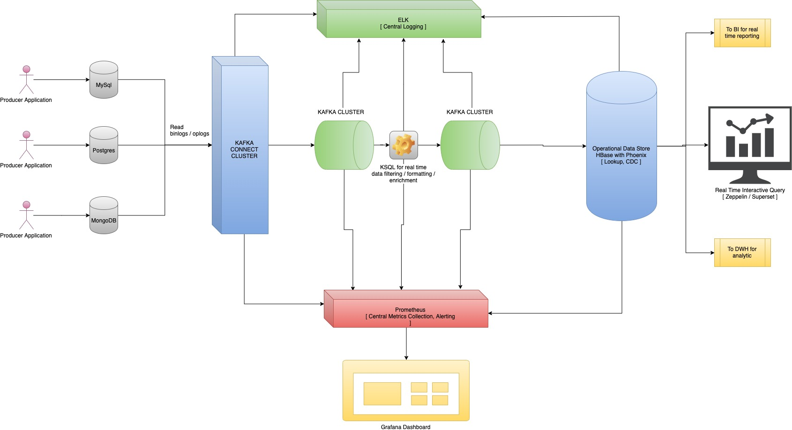

# Table of contents;
- [ System Design ](#design)
- [ Design Description ](#description)
- [ What has been covered in the solution ](#coverage)
- [ Querying through API ](#futurework)
- [ Running the solution ](#runsolution)

# System Design

# Design Description
- Different systems/applications/users push data to the relation/non-relational store
- Using Kafka Connect, we read the binlogs/oplogs of the sources and push changes in real time to Kafka Cluster
- We use KSQL to make any real time transformations, filtering and formatting of the data in Kafka. The data is moved from raw Kafka topic to cleansed Kafka topic
- Using Phoenix kafka consumer, we pull data to Operational Data Store. the Operational Data Store is HBase in our design to enable fast and random access to real time data
- HBase acts as a real time and unified replica of the diverse data sources. It acts as source of data for <b>Real Time Data Analytics</b> or <b>Batch DWH Analytics</b>
- The real time metrics are collected in Prometheus using custom jmx exporters. Metrics are collected from Kafka Connect, Kafka Brokers, KSQL and ODS
- Metrics are exposed in grafana. Alerts are configured directly in Grafana.
- The logs are stored in the central ELK using logstash plugin

# What has been covered in the solution
This solution is the part of the assignment. It is designed keeping in mind all of the above considerations. As of now following components have been developed.

- 3 databases Mysql, Postgres and MongoDB have been setup to run in docker containers
- 3 producer applications have been developed to push data to respective databases
- Kafka connect is configured and set up to run the connectors
- Kafka cluster is set up to store the CDC messages
- KSQL docker is setup in place. The script is developed to perform the transformation
- HBase and Phoenix have been setup.

# Future tasks
Following activities can be done in future to make it a complete solution.

- Setup ELK and install logstash to run on kafka connect, kafka brokers, ksql machine, hbase cluster to parse and send the logs to elastic search. These logs can then be viewed using kibana. (Ref: https://www.freecodecamp.org/news/how-to-use-elasticsearch-logstash-and-kibana-to-visualise-logs-in-python-in-realtime-acaab281c9de/
https://medium.com/krakensystems-blog/transforming-and-sending-nginx-log-data-to-elasticsearch-using-filebeat-and-logstash-part-1-61e4e19f5e54)
- Setup phoenix kafka client to pull messages from kafka and insert into phoenix. (Ref: https://phoenix.apache.org/kafka.html)
- Install proemetheus java agent on each machine and expose JMX metrics to be scrapped by promethues.
- Setup prometheus to pull metrics and store it in time-series databases.
- Setup grafana to get metrics from prometheus and visualize it.
- We can also set up zeppelin/superset to query and then visualize data from phoenix

# Running the solution
cd <PROJECT_DIR>

## Build custom images

cd connect-client

docker build -t connect-client .

cd ../mongodb

docker build -t mongodb .

cd ../producer/mongodb

docker build -t mongodb-producer .

cd ../mysql

docker build -t mysql-producer .

cd ../postgres

docker build -t postgres-producer .

cd ../..

## To launch docker containers
export VERSION=0.9

docker-compose -f docker-compose.yaml up

## To stop the docker containers
docker-compose -f docker-compose.yaml down

## View kafka messages
docker exec -it maf_kafka_1 bash

/kafka/bin/kafka-topics.sh \
  --bootstrap-server kafka:9092 \
  --list

/kafka/bin/kafka-console-consumer.sh \
  --bootstrap-server kafka:9092 \
  --property print.key=true \
  --topic mysql.maf.movie_ids

/kafka/bin/kafka-console-consumer.sh \
  --bootstrap-server kafka:9092 \
  --property print.key=true \
  --topic postgres.maf.tv_series_ids

/kafka/bin/kafka-console-consumer.sh \
  --bootstrap-server kafka:9092 \
  --property print.key=true \
  --topic mongodb.maf.person_ids

